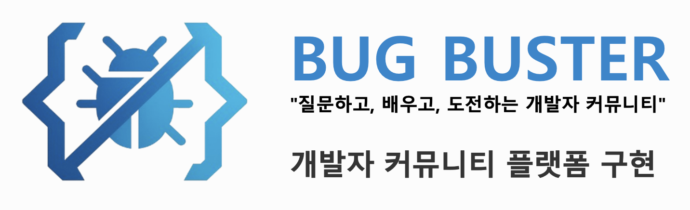

>개발자를 위한 커뮤니티 웹 애플리케이션입니다. Q&A 게시판, 알고리즘 문제 풀이, IT 뉴스 큐레이션 기능을 제공합니다.

Spring Legacy(비 Spring Boot) 기반으로 진행한 2인 팀 프로젝트입니다.

# 추진 배경 및 기대효과
## 추진 배경
- 필요한 정보들이 여러 플랫폼에 분산되어 있어 이동으로 인한 시간 낭비와 집중력 분산을 경험
- 각 플랫폼마다 다른 인터페이스로 인한 혼란
- 같은 정보를 여러 플랫폼에 입력하는 중복 작업
- 플랫폼 선택지 과다로 인한 피로감 상승

## 기대 효과
- 여러 플랫폼 이동에 소모되는 시간 제거함으로써 학습에만 집중할 수 있는 시간이 증대
- 통합된 데이터로 개인화 추천 가능
- 일관된 UI/UX로 직관적 사용
- 커뮤니티 활성화

# 기술 스택
#### **언어 / 런타임**
[](https://openjdk.org/)
[](https://maven.apache.org/)

#### **프레임워크**
[](https://spring.io/projects/spring-framework)
[](https://docs.spring.io/spring-framework/reference/web/webmvc.html)
[](https://spring.io/projects/spring-batch)
[](https://www.oracle.com/java/technologies/jsp.html)
[](https://projects.eclipse.org/projects/ee4j.jsp)

#### **영속성 / 데이터베이스**
[](https://mybatis.org/)
[](https://www.mysql.com/)

#### **프론트엔드**
[](https://developer.mozilla.org/en-US/docs/Web/Guide/HTML/HTML5)
[](https://developer.mozilla.org/en-US/docs/Web/CSS)
[](https://developer.mozilla.org/en-US/docs/Web/JavaScript)

#### **외부 API 연동**
[](https://developers.naver.com/)
[](https://deepmind.google/technologies/gemini/)

#### **메일**
[](https://www.oracle.com/java/technologies/javamail.html)

#### **로깅**
[](https://www.slf4j.org/)
[](https://logging.apache.org/log4j/)

#### **유틸리티**
[](https://projectlombok.org/)
[](https://commons.apache.org/proper/commons-fileupload/)
[](https://www.eclipse.org/aspectj/)

#### **테스트**
[](https://junit.org/junit4/)
[](https://site.mockito.org/)

#### **개발 도구**
[](https://www.jetbrains.com/idea/)
[](https://spring.io/tools)
[](https://dbeaver.io/)
[](https://www.jetbrains.com/datagrip/)

#### **협업 / 커뮤니케이션**
[](https://slack.com/)
[](https://discord.com/)


## 주요 기능

### 회원
- 회원가입, 로그인 / 로그아웃, 아이디 중복 확인
- 비밀번호 확인 및 재설정
- 마이페이지, 회원 정보 수정, 회원 탈퇴
- 관심 태그(`member_interest`) 등록

### 게시판
- 글 작성 / 조회 / 수정 / 삭제, 코드 본문 첨부
- 파일 업로드(최대 10MB), 조회수 집계
- 좋아요 등록 및 카운트 조회
- 댓글 / 대댓글(계층 구조, `depth`)

### 문제 풀이
- 언어별 프로그래밍 문제 목록 및 상세 조회
- 풀이 코드 제출(`submissions`), 정답 여부 및 피드백 저장

### IT 뉴스
- 네이버 뉴스 검색 API를 이용한 기사 수집
- 스케줄러 기반 주기적 배치 갱신
- 키워드 검색, 카테고리 분류

### 공통
- `AuthInterceptor`를 통한 로그인 상태 검사(비로그인 허용 경로는 `servlet-context.xml`에서 관리)
- 전역 예외 처리: `CustomException` → 에러 페이지(`error.jsp`) 매핑

## 아키텍처

```
Controller (www.silver.controller)
        │
        ▼
Service (www.silver.service)
        │
        ▼
DAO (www.silver.dao)
        │
        ▼
MyBatis Mapper (src/main/resources/mapper/*Mapper.xml)
        │
        ▼
MySQL
```

- 배치: `NewsUpdateScheduler` → `NewsUpdateBatch` / `NewsUpdateTasklet`
- 설정 파일
  - `WEB-INF/spring/root-context.xml`: DataSource, MyBatis, Spring Batch, 서비스 / DAO 컴포넌트 스캔
  - `WEB-INF/spring/appServlet/servlet-context.xml`: MVC 설정, 인터셉터, ViewResolver, 파일 업로드

## 디렉터리 구조

```
BugBuster-Community/
├── sql/
│   ├── schema.sql          # 테이블 정의 (CREATE TABLE)
│   └── data.sql            # 초기 데이터 (프로그래밍 문제 시드)
├── src/main/
│   ├── java/www/silver/
│   │   ├── controller/     # 컨트롤러
│   │   ├── service/        # 서비스 계층
│   │   ├── dao/            # DAO 계층
│   │   ├── vo/             # 값 객체
│   │   ├── batch/          # Spring Batch 작업
│   │   ├── scheduler/      # 스케줄러
│   │   ├── interceptor/    # 인증 인터셉터
│   │   ├── exception/      # 예외 처리
│   │   └── util/           # 유틸리티
│   ├── resources/
│   │   ├── mapper/         # MyBatis 매퍼 XML
│   │   └── log4j.xml
│   └── webapp/WEB-INF/
│       ├── spring/         # Spring 설정 XML
│       └── views/          # JSP 뷰
└── pom.xml
```

## 실행 방법

### 1. 요구 사항
- JDK 8
- Maven 3.6+
- MySQL 5.7+ 또는 8.x
- Servlet 3.1 지원 WAS (Tomcat 8.5+ 권장)

### 2. 데이터베이스 준비

```sql
CREATE DATABASE bugbuster DEFAULT CHARACTER SET utf8mb4;
```

```bash
mysql -u root -p bugbuster < sql/schema.sql
mysql -u root -p bugbuster < sql/data.sql
```

Spring Batch 메타 테이블은 애플리케이션 기동 시 자동 생성됩니다.

### 3. 설정

`src/main/resources/config.properties.example`를 복사해 `config.properties`를 만들고 값을 채웁니다.

```bash
cp src/main/resources/config.properties.example src/main/resources/config.properties
```

| 키 | 설명 |
| --- | --- |
| `db.url`, `db.username`, `db.password` | MySQL 접속 정보 |
| `naver.client.id`, `naver.client.secret` | 네이버 뉴스 검색 API 키 (https://developers.naver.com/apps) |

`config.properties`는 `.gitignore`에 등록되어 있어 커밋되지 않습니다.
파일 업로드 경로는 `servlet-context.xml`의 `/tmp/**` 리소스 매핑에서 환경에 맞게 조정합니다.

### 4. 빌드 및 배포

```bash
mvn clean package
```

생성된 `target/*.war`를 Tomcat에 배포합니다.

## 개선 과제
- 하드코딩된 업로드 경로(`file:/C:/tmp/`) OS 비의존적으로 변경
- 테스트 코드 추가(`src/test` 부재)
- log4j 1.2(지원 종료) → logback 또는 log4j2 마이그레이션
